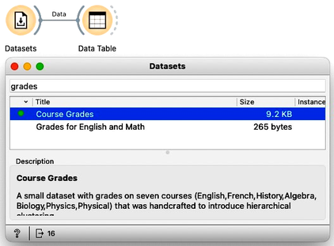
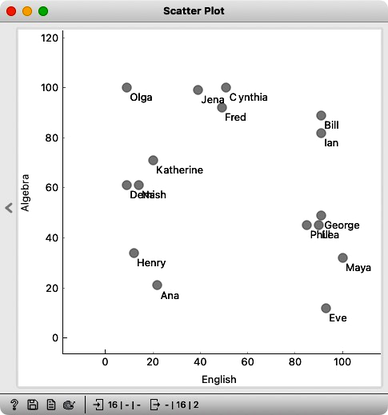
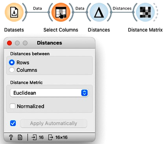
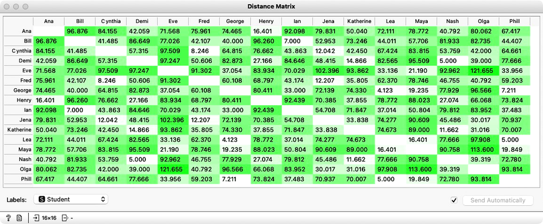

Clustering, that is, the detection of groups of objects, is one of the basic procedures we use to analyze data. We can, for instance, discover groups of people according to their user profiles through service usage, shopping baskets, behavior patterns, social network contacts, usage of medicines, or hospital visits. Or cluster products based on their weekly purchases. Or genes based on their expression. Or doctors based on their prescription.

Most popular clustering algorithms rely on relatively simple algorithms that are easy to grasp. In this section of our course, we will introduce a procedure called hierarchical clustering. Let us start, though, with the data and with the measurement of data distances.

We will use the data on student grades. The data is available through Orange’s [Datasets](https://orangedatamining.com/widget-catalog/data/datasets/) widget. We can find it by typing "grades" in the filter box. We can examine this data in the Data Table. Sixteen students were graded in seven different subjects, including English, French, and History. 

We would like to find students whose grades are similar. A teacher, for instance, may be interested to know if she has students talented in different areas so that she can adjust their training load appropriately. While, for this task, we would need to consider all the grades, we will simplify this introduction to consider only grades from English and Algebra, constructing, in this way, a two-dimensional data set.

To select only specific variables from the data, we can use the [Select Columns](https://orangedatamining.com/widget-catalog/data/selectcolumns) widget. We will ignore all features except English and Algebra. We can do this by selecting all the features, moving them to the Ignored column, and then dragging English and Algebra back to the Features column. It is allways good to check the results in the Data Table.

<!!! float-aside !!!>
We here selected English and Algebra for no particular reason. You can repreat and try evertyhing from this lesson with some other selection of feature pair.

Since we have the data with only two features, it is best to see it in the [Scatterplot](https://orangedatamining.com/widget-catalog/visualize/scatterplot). We can label the dots representing students with their names. 

<!!! float-aside !!!>
If all the data on this planet would be two-dimensional, we could do all the data analysis in the scatter plots.

We can see Olga with a high math grade on the top left and Maya in the opposite corner of the plot. They are really far apart and definitely would not be in the same cluster. On the other hand, George, Phil, and Lea have similar grades in both subjects, and so do Jena, Cynthia, and Fred. The distances between these three students are small, and they appear close to each other on the scatterplot.

There should be a way to formally measure the distances. In real life, we would just use a ruler and, for instance, measure the distance between Katherine and Jena by measuring the length of the line that connects them. But since Orange is a computer program, we need to tell it how to compute the distances. Well, Katherine’s grade in English is 20, and Jena’s is 39. Their English grade difference is 19. Katherine scored 71 in Algebra and Jena’s 99. The algebra grade difference is 28. According to Pythagoras, the distance between Katherine and Jena should be a square root of 19 squared plus 28 squared, which amounts to about 33.8. 

We could compute distances between every pair of students in this way. But Orange can do this for us.

We will use the Distances widget and, for now, remove normalization. The grades in English and Math are expressed in the same units, so there is no need for normalization now. We’ll keep the distance matrix set to Euclidean distance, as this is exactly the one as we have defined for Katherine and Jena.

<!!! float-aside !!!>
Warning: the Normalization option in the Distances widget should always be on. We have switched it off just for this particular data set to compare the computed distances to those we have calculated by hand. Usually, the features are expressed in different scales. To jointly use these features in the computation of the Euclidean distances, we have to normalize them.

We can look at the distances in the Distance Matrix, label the columns and rows with student names, and find that the distance between Katherine and Jena is indeed 33.8, as we have computed before. 

We now know how to compute the distances in two-dimensional space. The idea of clustering is to discover groups of data points, that is, students, whose mutual distance is low. For example, in our data, Jena, Cythia and Fred look like a good candidate group. And so does Phil, Lea and George. And perhaps Henry and Ana. Well, we would like to find the clustering for our entire set of students. But how many clusters are there? And what clustering algorithm to use? 