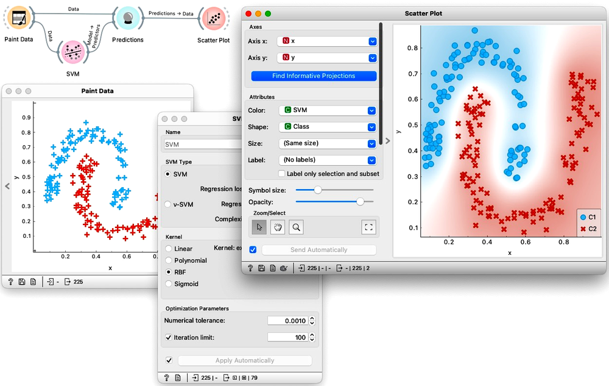

<!!! width-60 float-aside !!!>

    
    Linear decision boundary of a logistic regression classifier.

Support vector machines (SVM) are a type of linear classifier that are similar to logistic linear regression in that they seek to find a decision boundary to separate data instances of different classes. However, SVM can transcend the limitation of dividing the data by a simple plane by utilizing the "kernel trick." This method involves transforming the hyperplane, or decision boundary, to a higher-dimensional space that includes additional features beyond the individual ones, such as their products and other combinations. This approach allows SVM to fit the data more effectively and separate the classes with a linear hyperplane, making it capable of functioning as a non-linear classifier and fitting more complex datasets.

<!!! width-60 float-aside !!!>

    
    Decision boundary of a support vector machine classifier with an RBF kernel.

SVM, along with other kernel methods, possesses the ability to implicitly discover a transformation into a usually infinite-dimensional space, in which the kernel specifies the distances between objects and where a linear hyperplane can be drawn. In practical terms, SVM can split the data using more complex structures than conventional linear hyperplanes by employing various kernels. The complexity of the resulting structure is determined by the kernel type and algorithmic parameters, such as the type of combinations of original features and new coefficients, as well as the penalty for misclassifications.

In the workflow below, we painted a data set and intentionally introduced two classes that cannot be separated with a linear plane. We fed the data into the Predictions widget, and provided it a classifier developed on the same data set. Notice that here we were only interested if the SVM can develop a suitable decision boundary. And obviously it can. Scatter Plot shows that SVM correctly classified all of the data instances in the training set and, as estimated with a white area between blue and red regions, it inferred a non-linear classification boundary.

<!!! width-max !!!>
