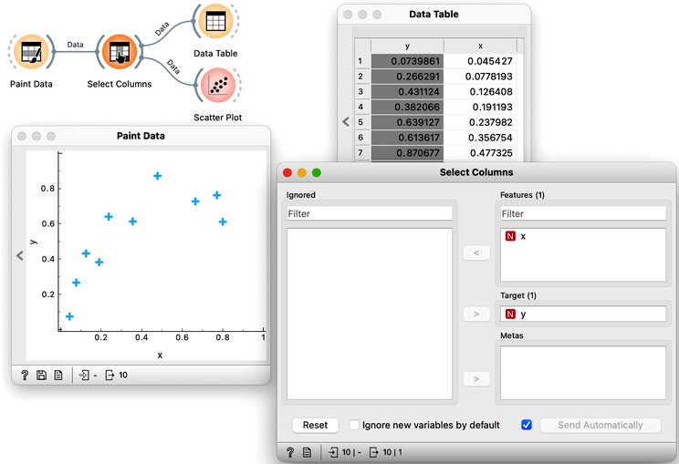
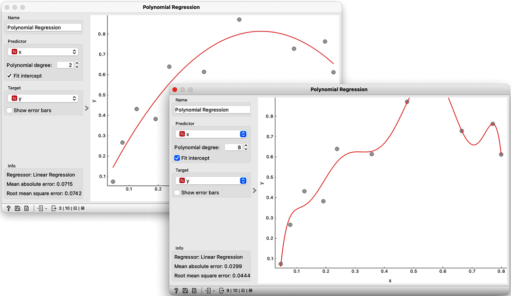

\marginnote{In the \widget{Paint Data} widget, remove the C2 label from the list. If you have accidentally left it while painting, don't despair. The class variable will appear in the \widget{Select Columns} widget, but you can "remove" it by dragging it into the Available Variables list.} 

For a start, let us construct a very simple data set. It will contain just one continuous input feature (let's call it x) and a continuous class (let's call it y). We will use Paint Data, and then reassign one of the features to be a class using Select Columns widget, moving the feature y from "Features" to "Target Variable". It is always good to check the results, so we are including Data Table and Scatter Plot in the workflow at this stage. We will be modest this time and only paint 10 points and use Put instead of the Brush tool.

We want to build a model that predicts the value of the target variable y from the feature x. Say that we would like our model to be linear, to mathematically express it as h(x)=w0+w1 x. Oh, this is the equation of a line. So we would like to draw a line through our data points. The w0 is then an intercept, and w1 is a slope. But there are many different lines we could draw. Which one is the best? Which one is the one that fits our data the most? Are they the same?

<!!! float-aside !!!>
Do not worry about the strange name of the [Polynomial Regression](https://orangedatamining.com/widget-catalog/educational/polynomial-regression/), we will get there in a moment.

The question above requires us to define what a good fit is. Say, this could be the error the fitted model (the line) makes when it predicts the value of y for a given data point (value of x). The prediction is h(x), so the error is h(x) - y. We should treat the negative and positive errors equally, plus -- let us agree -- we would prefer punishing larger errors more severely than smaller ones. Therefore, we should square the errors for each data point and sum them up. We got our objective function! It turns out that there is only one line that minimizes this function. The procedure that finds it is called linear regression. For cases where we have only one input feature, Orange has a special widget in the Educational add-on called [Polynomial Regression](https://orangedatamining.com/widget-catalog/educational/polynomial-regression/).

Looks ok, except that these data points do not appear exactly on the line. We could say that the linear model is perhaps too simple for our data set. Here is a trick: besides the column $x$, the widget \widget{Polynomial Regression} can add columns x^2, x^3, ..., x^n to our data set. The number n is a degree of polynomial expansion the widget performs. Try setting this number to higher values, say to 2, and then 3, and then, say, to 8. With the degree of 3, we are then fitting the data to a linear function h(x) = w0 + w1 x + w2 x^2 + w3 x^3.

The trick we have just performed is polynomial regression, adding higher-order features to the data table and then performing linear regression. Hence the name of the widget. We get something reasonable with polynomials of degree 2 or 3, but then the results get wild. With higher degree polynomials, we overfit our data.

<!!! float-aside !!!>
It is quite surprising to see that the linear regression model can fit non-linear (univariate) functions. It can fit the data with curves, such as those on the figures. How is this possible? Notice, though, that the model is a hyperplane (a flat surface) in the space of many features (columns) that are the powers of x. So for the degree 2, h(x)=w0 + w1 x + w2 x^2 is a (flat) hyperplane. The visualization gets curvy only once we plot h(x) as a function of x.

Overfitting is related to the complexity of the model. In polynomial regression, the parameters w define the model. With the increased number of parameters, the model complexity increases. The simplest model has just one parameter (an intercept), ordinary linear regression has two (an intercept and a slope), and polynomial regression models have as many parameters as the polynomial degree. It is easier to overfit the data with a more complex model, as it can better adjust to the data. But is the overfitted model discovering the true data patterns? Which of the two models depicted in the figures above would you trust more?
