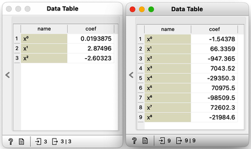
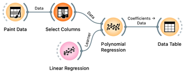

There has to be some cure for overfitting. Something that helps us control it. To find it, let's check the values of the parameters $\theta$ under different degrees of polynomials.

With smaller degree polynomials, values of $\theta$ stay small, but then as the degree goes up, the numbers get huge.

<!!! float-aside !!!>
Which inference of linear model would overfit more, the one with high $\lambda$ or with low $\lambda$? What should the value of $\lambda$ be to cancel regularization? What if the value of $\lambda$ is high, say 1000?

More complex models can fit the training data better. The fitted curve can wiggle sharply. The derivatives of such functions are high, so the coefficients $w need be. If only we could force the linear regression to infer models with a small value of coefficients. Oh, but we can. Remember, we have started with the optimization function the linear regression minimizes — the sum of squared errors. We could add to this a sum of all w squared. And ask the linear regression to minimize both terms. Perhaps we should weigh the part with w squared, say, with some coefficient w, to control the level of regularization.

Here we go: we just reinvented regularization, which helps machine learning models not overfit the training data. To observe the effects of regularization, we can give \widget{Polynomial Regression} to our linear regression learner, which supports these settings.

<!!! float-aside !!!>
Internally, if no learner is present on its input, the Polynomial Regression widget would use just ordinary, non-regularized linear regression.

The Linear Regression widget provides two types of regularization.  Ridge regression is the one we have talked about and minimizes the sum of squared coefficients w. Lasso regression minimizes the sum of the absolute value of coefficients. Although the difference may seem negligible, the consequences are that lasso regression may result in a large proportion of coefficients w being zero, in this way performing feature subset selection.

<!!! float-aside !!!>

Now for the test. Increase the degree of polynomial to the max. Use Ridge Regression. Does the inferred model overfit the data? How does the degree of overfitting depend on regularization strength?
