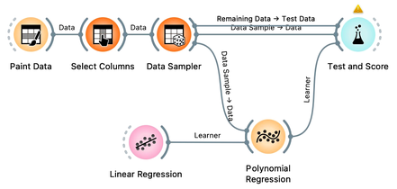

<!!! float-aside !!!>

Paint about 20 to 30 data instances. Use the attribute y as the target variable in Select Columns. Split the data 50:50 in Data Sampler. Cycle between "Test on train data" and "Test on test data" in Test and Score. Use ridge regression to build a linear regression model. 

Overfitting hurts. Overfit models fit the training data well but can perform miserably on new data. Let us observe this effect in regression. We will use hand-painted data set, split it into the training (50) and test (50) data set, polynomially expand the training data set to enable overfitting and build a model. We will test the model on the already seen training data and the unseen held-out data.

Now we can vary the regularization strength in Linear Regression and observe the accuracy in Test and Score. For accuracy scoring, we will use RMSE, root mean squared error, which is computed by observing the error for each data point, squaring it, averaging this across all the data instances, and taking a square root.

The core of this lesson is to compare the error on the training and test set while varying the level of regularization. Remember that regularization controls overfitting. The more we regularize, the less tightly we fit the model to the training data. So for the training set, we expect the error to drop with less regularization and more overfitting. The error on the training data increases with more regularization and less fitting. We expect no surprises here. But how does this play out on the test set? Which sides minimizes the test-set error? Or is the optimal level of regularization somewhere in between? How do we estimate this level of regularization from the training data alone?

Orange is currently not equipped with the fitting of meta parameters, like the degree of regularization, and we need to find their optimal values manually. At this stage, it suffices to say that we must infer meta parameters from the training data set without touching the test data. If the training data set is sufficiently large, we can split it into a set for training the model and a data set for validation. Again, Orange does not support such optimization yet, but it will sometime in the future. :)