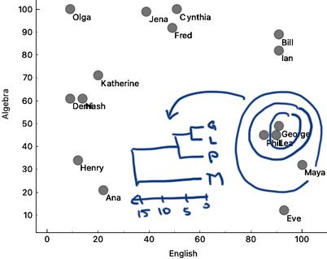
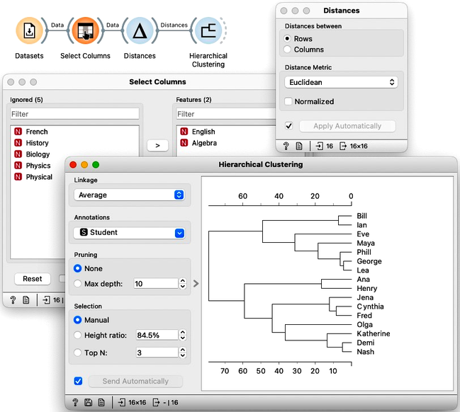
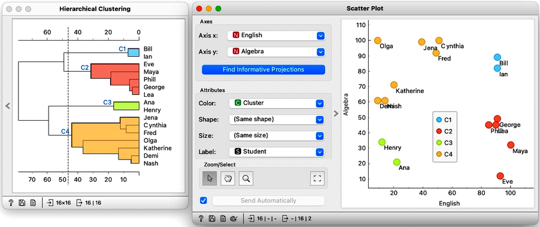

So far, we have reduced the data we used in an example for hierarchical clustering to only two dimensions by choosing English and Algebra as oot features. We said we could use Euclidean distance to measure the closeness of two data items. Then, we noted that hierarchical clustering starts with considering each data item in its own cluster and iteratively merges the closest clusters. For that, we needed to define how to measure distances between clusters. Somehow, intuitively, we used average linkage, where the distance between two clusters is the average distance between all of their elements.

In the previous chapter, we simulated the clustering on the scatter plot, and the resulting visualization on the scatter plot was far from neat. We need a better presentation of the hierarchical clustering results. Let's, again, start with the data set, select the variables, and plot the data in the scatter plot. 

Let's revisit the English-Algebra scatter plot. When we join the two clusters, we can remember the cluster distance and plot it in a graph. Say, we join George and Lea, where their distance is about 5. Then we could add Phil to the George-Lea cluster, with the distance, say, 6. Then Bill and Ian with a distance of 7. And then, a while later on, I add Maya to Phil-Lea-George at a distance of 15. We can represent this merging of the clusters in a graph, hand-drawn here in the depiction below.

The cluster merging graph that we are showing here is called a dendrogram. Dendrogram visualizes a structure of hierarchical clustering. Dendrogram lines never cross, as the clustering starts with clusters close to each other, and cluster distances we find when iteratively merging the clusters grow larger and larger.

To construct hierarchical clustering in Orange, we first need to measure distances. We have done this already in a previous chapter, where we used [Distances](https://orangedatamining.com/widget-catalog/unsupervised/distances) widget. We will use Euclidean distance, and only for this data set, we will not normalize the data. We now use these distances, send them to [Hierarchical Clustering](https://orangedatamining.com/widget-catalog/unsupervised/hierarchicalclustering/) widget and construct the dendrogram. 

<!!! float-aside !!!>
We are still working on the two-dimensional data set, hence the use of Select Columns to pick only English and Algebra grades from our example dataset.

We may remember from our writing on distances that Lea, George, and Phil should be close, and that Maya and Eve join this cluster later. Also, the distance between Bil and Ian is small, but they are far from the George-Lea-and-the-others cluster. We can notice all these relations, and inspect the entire clustering structure from the dendrogram above. 

We can now cut the dendrogram to expose the groups. Here, we cut it such that we get three clusters. Where are they in the scatter plot? The Hierarchical Clustering widget emits the Selected Data signal. Here, by cutting the dendrogram, we selected all the data instances, so it should also include the information on the clusters.

<!!! width-max !!!>

We can use this workflow to experiment with the number of clusters by placing the cutoff line at different positions. Here is an example with four clusters where Bill and Ian are on their own. No wonder, as they are the only two performing well in both English and Algebra.

<!!! width-max !!!>

How many clusters are there in our data? Well, this is hard to say. Dendrogram visualizes the clustering structure, and it is usually up to domain experts, in this case, the teachers, to decide what they want. In any case, it is best to select the cut-off for the clustering where the number of clusters would not change under small perturbation of the data. Note, though, that everything we have done so far was on the two-dimensional data. We now need to move to higher number of dimensions.