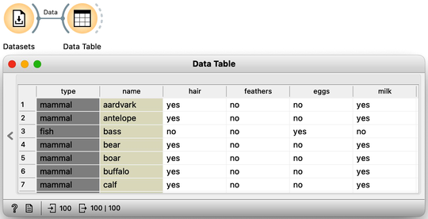
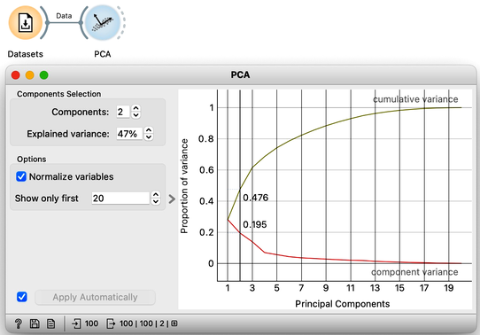
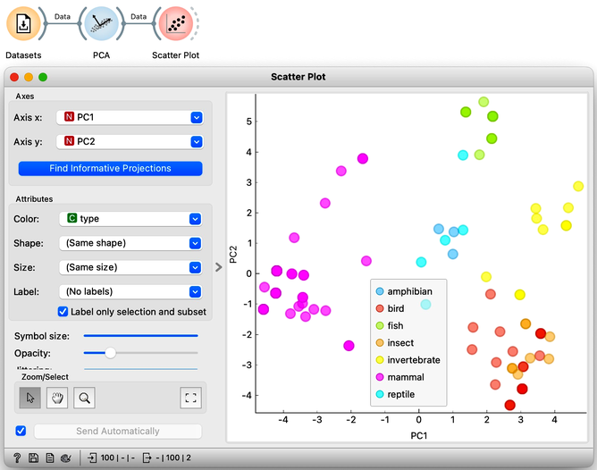
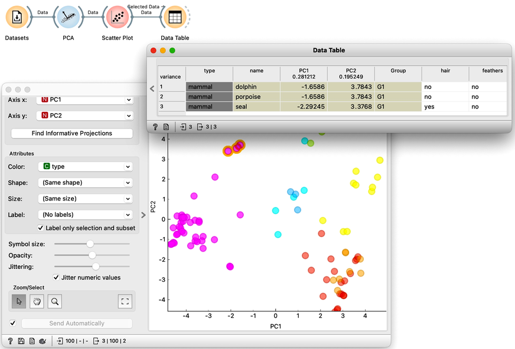

Let’s take a second and think about the stars. A typical image of the night sky is, according to Google, maybe the one below. See the bright line across the sky? That's our galaxy, the Milky Way. Or better yet, a two-dimensional projection of our galaxy, like we see it from Earth. 

That's an odd way of thinking about stars. However, based on the night sky's appearance, one could model our galaxy as a line. Meaning that most of the Milky Way stars are positioned side by side on a straight line. Well, we know that this is not so. Astronomers have measured the distances of stars in our galaxy and figured out that it is more of a spiral shape, like shown below.

This image is also a two-dimensional projection of the stars in our three-dimensional galaxy. So which model of our galaxy is better, a line or a spiral? Which tells us more about the Milky Way? And selecting a specific star, which of our models tells us more about its location in relation to other stars? Well, the more informative projection is obviously the spiral.

In data science, we also like visual depictions of data. Think of each data instance as a star but positioned in a multi-dimensional space. Now, just like visualizing the Milky Way as a spiral, we would like to find a two-dimensional projection of some data while retaining as much information as possible. A popular technique for finding such a projection is called principal component analysis or PCA for short. 

Let’s use PCA on some example data. We will will use the zoo data set from the Datasets widget. The data describes animals like bears, boars, and catfish with features that provide information about animals, having hair, fathers, laying eggs, or giving milk. The data also includes information about the type of animal.

We can send this data into the PCA widget. PCA aims to find the axis – principal components – in a multi-dimensional space where data varies the most. For our zoo data set, PCA tells us that the first, most informative component explains 28% of the variance and that the second component explains another 19% of the variance. Together, they account for almost half of the total variance in the data. For now we are only interested in two-dimensional plots and will only be concerned with the first two principal components.

<!!! float-aside !!!>
Notice that PCA analysis considers only the data features. That is, it ignores the information from other types of variables, like the class and any meta features.

On one of the the outputs of the PCA widget is our data with two additional columns: PC1 and PC2. These define the position of each data instance, that is, each animal, in the projection found by PCA. We can actually use these two coordinates in a scatterplot. We need to use PC1 for the x-axis and PC2 for the y-axis. We will also instruct my scatter plot to color the points according to the type of animal. Nice, as we might have expected, all the mammals appear close to each other in the plot, and so do the fish and reptiles. The insects, however, are a little intermixed with the birds.

Let’s select the mammals here, closest to the fish, and take a look at them in the Data Table. Unsurprisingly we find the dolphin, porpoise, and seal. Dolphins and porpoises have the same value of all features; so they are projected to the same coordinates in the PCA plane. We can uncover this by jittering the points a little bit.

<!!! width-max !!!>

