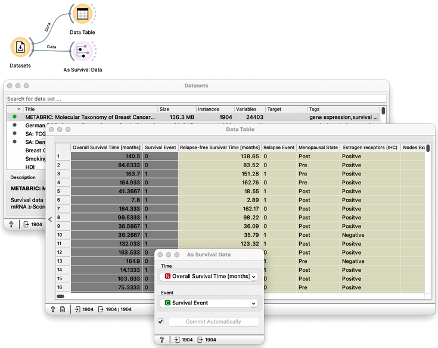
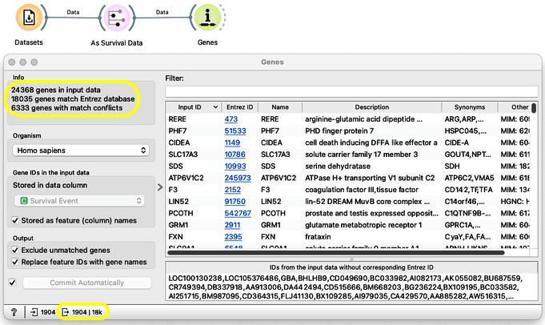
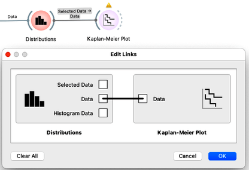
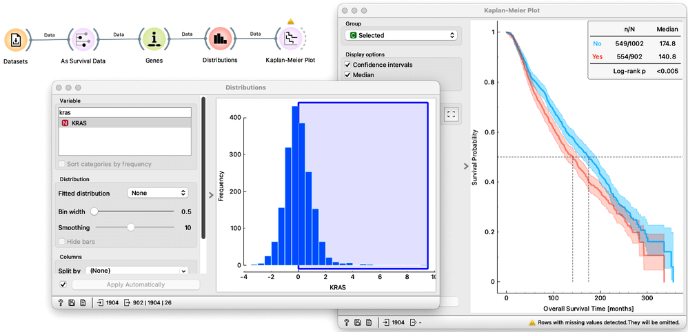
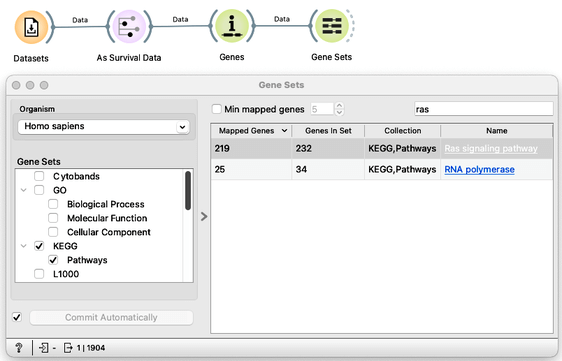
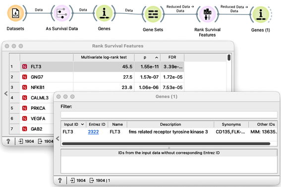
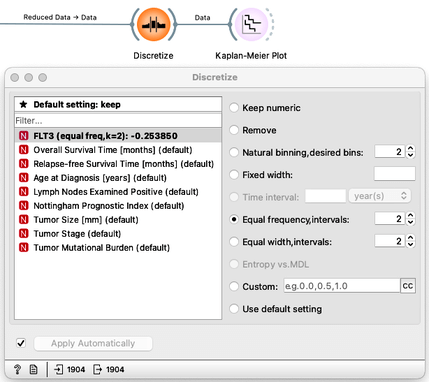
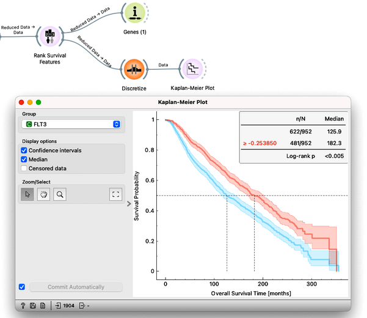

Previously we explored breast cancer data and ranked the eight clinical features according to their effect on survival. Emerging data sets in biomedicine can include many more features though. For example, tissue samples are characterized by the expression of thousands of genes. We'll now learn how to explore such data according to survival. For this we will need to install the Bioinformatics Add On, which is available in the Options menu. Orange needs to restart after installing an add-on.

The next step is loading the dataset. We will explore the METABRIC study which includes the survival data of 1904 patients with primary breast tumors. Each patient sample is characterized by 35 clinical features and the expression of over 24 000 genes. We can take a quick look in the Data Table widget. Scrolling to the right, we can see the clinical features and the thousands of gene expression values. We also find the data appropriately includes the Time and Event marked as target features. However, there are two more Time and Event columns marked as meta features. This is because, in this study, they measured the recurrence-free survival time as well as the overall survival. Recurrence-free survival time refers to the time until cancer recurrence, and overall survival refers to the time until breast cancer related death. We will use the As Survival Data widget to specify which time and event pair we want to explore. Let’s select overall survival.

If we want to use the bioinformatics widgets on some dataset of genes, we have to pass the data through the Genes widget. This will match the names of genes with the NCBI Gene database, and annotate the data with the appropriate gene codes. The first time you use this widget it will have to load all the data from the server, which may take a few minutes. Now that we’re done we can see that each gene has an ID and a short description. From 24000 genes, the widget matched 18000, so we will be working on a slightly reduced dataset.

With this many features you might wonder; how do we analyze all of this data? Many biomedical researchers are focused on finding genes that could be used for cancer prognosis. For example, breast cancer researchers have identified the proto-oncogene KRAS as an important factor. There is an article 
that reported high expressions of KRAS are linked to significantly worse projections for patients in the METABRIC study. Let’s try to reproduce one of the Kaplan-Meier plots from this report in Orange.

<!-- <!!! float-aside !!!>
Remember, Orange’s widgets often output subsets as well as complete datasets with annotations. Rewire the connections if need be. 
 -->

Gene expression values are continuous. We already know that this means we need to define a threshold to form groups to compare survival. We can again do this with the Distributions widget. On the left, we filter the features to find KRAS and then adjust the bin width. The gene expression values in this data set are normalized, so we’ll select the values above 0. This should split the data more or less in half. We can connect Distributions to the Kaplan-Meier plot and rewire the connection to pass on all the data. In the  Kaplan-Meier widget, we choose Selected for the group indicator and tick the boxes to display the confidence intervals and the median. The p-value below 0.005 indicates that there is indeed a significant difference in the survival curves between patients with KRAS expression above or below 0. The ones we selected on the Distributions graph, those with expression above 0, are depicted by the red line.

<!!! width-max !!!>

KRAS is a member of the RAS protein family. RAS proteins function as molecular switches for signaling pathways that are critical for several aspects of normal cell growth. They are mutated in a variety of human tumors. The set of all RAS genes forms a gene set. More generally, gene sets are lists of genes associated with a specific biological function, and are widely used in studying expression data. We will compare how well other genes in the RAS pathway separate the survival curves of cohorts, with regards to KRAS.

Pass the information from Genes to the Gene Sets widget. We can use this widget for filtering out a specific gene set from our expression data. On the left, we can select the organism and the gene set database that we are interested in. Homo sapiens is already correctly marked. The Ras pathway is available through the KEGG pathway database. We choose KEGG on the right and write ‘ras’ in the filter tab. The Ras signaling pathway contains 232 genes, but only 219 have been found in our METABRIC dataset. Click on the pathway to output the filtered genes and their expression values. 

Now, connect the output with Rank Survival Features. Previously, we used this widget for ranking clinical features to figure out which ones best separate cohorts according to survival. This time, we will use it for ranking genes in a gene set! Because gene expression values are numeric, the Rank widget forms cohorts by splitting the expression values at the median. Let’s order the genes according to the p-value. We find that KRAS is only in 33rd place! The gene that is best at separating patients by survival is FLT3. Select the gene by clicking on it. If we want to know what FLT3 means, we can pass the information to the Genes widget. The protein product of FLT3 expression functions as a receptor tyrosine kinase that is normally expressed on hematopoietic stem cells. Its mutations are well studied in acute myeloid leukemia, however upregulated FLT3 expression has also been observed in lymph node metastases of patients with primary breast cancer.

 On the left, select FLT3, and on the right, choose to form intervals of equal frequency.

<!--  -->

Let’s go ahead and plot the survival curves defined by FLT3. Pass the output from Rank to Discretize and then to the Kaplan-Meier Plot. We group by FLT3 and select to display confidence intervals and the median. 

We can now compare the two plots side by side, one grouping patients according to the expression of KRAS and the other according to the expression of FLT3. There is a visible difference! Notice that whereas above median expression of KRAS is predictive of poor survival, above median expression of FLT3 is predictive of higher survival probability. Indeed, a quick search through the literature confirms that higher expression of FLT3 indicated a favorable prognosis in patients with breast cancer. 

