In this last chapter we will learn how to find informative gene sets regarding survival. That is, instead of single genes, we will consider groups of genes.

First, we will load and preprocess the data in Orange. We will be working with a survival dataset from The Cancer Genome Atlas - or TCGA - that includes 306 samples from patients with cervical cancer. Let’s inspect the data in the Data Table. Each sample includes the overall survival time, an event column with information on whether or not the patient died of cervical cancer, and the expression values of over 23000 genes.

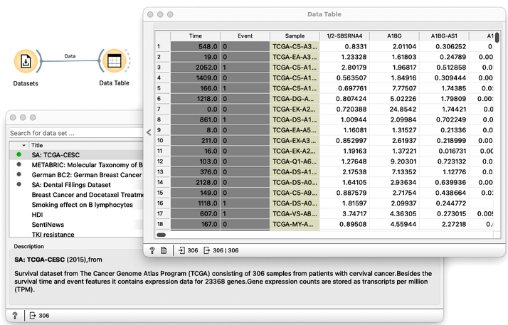

Next, we must pass the data through the Genes widget to map the names to the gene IDs that will be used later in the workflow. This can take a few moments. In the top left corner, we can see that about 22000 genes have been successfully matched with their NCBI IDs.  

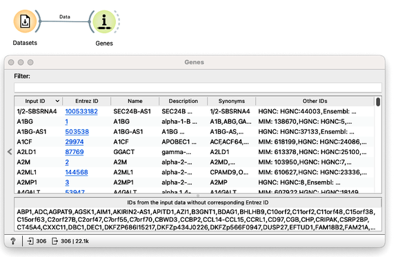

A gene set is a list of genes representing a particular biological function, usually corresponding to a specific molecular pathway. For example, genes involved in glucose degradation make up the glycolysis gene set. We want to know how the over- or under-expression of a particular pathway correlates with the survival of patients. One way of doing this is to first evaluate the expression of a pathway in each sample. A high pathway enrichment score will, roughly, tell us that the molecular pathway is over-expressed. We will use a version of gene set enrichment analysis modified to evaluate single samples called single sample gene GSEA. 

<!!! float-aside !!!>
In Orange, single sample GSEA is implemented in a widget called Single Sample Scoring. We can see that this widget requires two inputs: the expression data and one or more gene sets. 
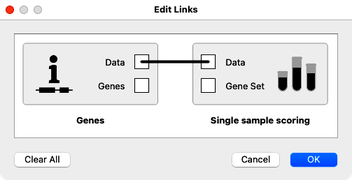

We will choose a molecular pathway from the Gene Sets widget. Let's look at the collection of gene sets called Hallmark gene sets from the Molecular Signatures Database. Hallmark gene sets represent specific, well-defined biological processes and are a useful gene set collection to start with. On the right, we can see that this collection includes gene sets corresponding to inflammatory response, hypoxia, heme metabolism, etc. We will select the hypoxia gene set, which contains genes that are up-regulated in response to low oxygen levels. Now we just check that single sample GSEA is the selected method in the Single Sample Scoring widget. We can now connect Gene Sets to the Single Sample Scoring widget. 

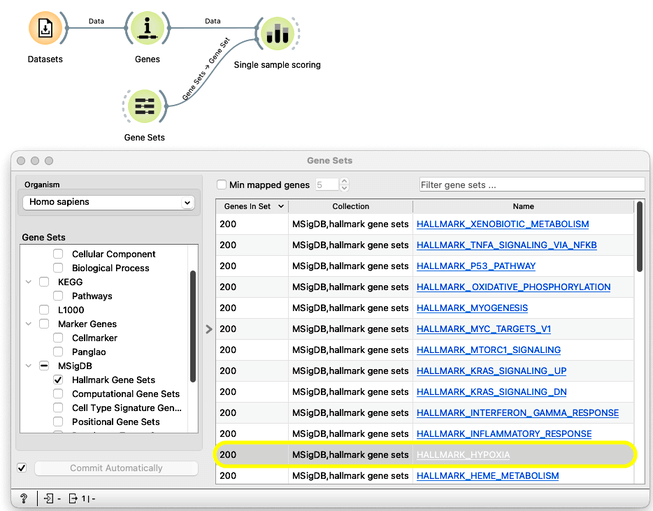

It immediately starts calculating an enrichment score for each sample. We inspect the output in another Data Table. We find the same gene expression data table as before. Except now there’s a new column representing the enrichment score for the hypoxia hallmark gene set. A higher value suggests that hypoxia-related genes are overexpressed in that particular sample. 

<!!! width-max !!!>
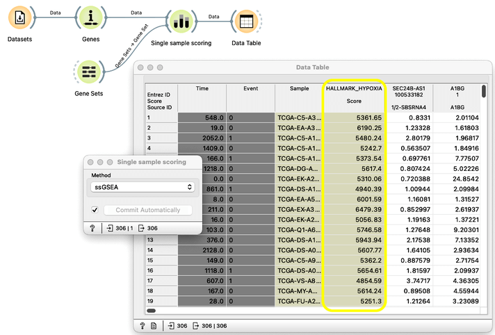

To find how informative a pathway is in relation to survival, we can treat the enrichment scores for a given gene set as a new continuous variable. As previously with continous data, we have to split the data at some threshold i.e. the median. First, reduce the dataset to include only the two survival features and the enrichment scores for the hypoxia gene set. We can do this in Select Columns. Under Features, select all of the genes and move them to the Ignored list. Then choose the hypoxia hallmark gene set from the Metas list and move it to the Features list. The widget status bar shows that its output is now a reduced dataset with only one column. 

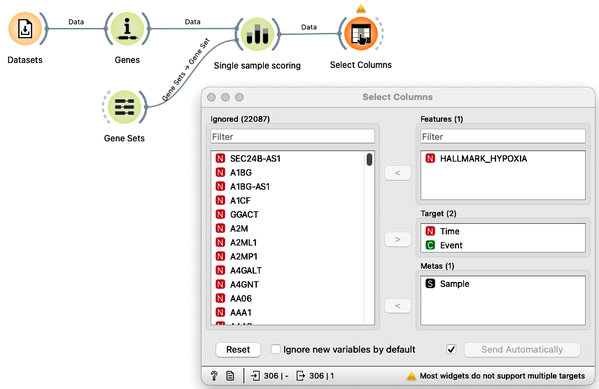

<!!! float-aside !!!>
Note, instead of  Discretize we could use Distributions or Select Rows to define a threshold.
<!-- 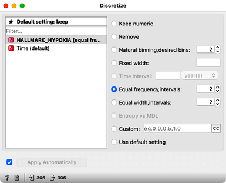 -->

Pass this reduced dataset to Discretize. Select the hypoxia gene set feature, and on the right choose to split the data into intervals of equal frequency. Next, pass the data on to the Kaplan-Meier widget. Upon opening it, select to group by the gene set of interest and choose to display the confidence intervals and the median. The red line represents patients with the up-regulation of genes that respond to low oxygen levels. We can see that the up-regulation of hypoxia-related genes is associated with a worse survival prognosis. Hypoxia is often observed in larger tumors since the proliferation of cancer cells can cause the tumor to outgrow the network of blood vessels that supplies tumor cells with oxygen.

Instead of choosing a specific gene set, such as the hypoxia one, we might want to compare several gene sets in relation to survival. Previously, we compared how different clinical features or gene expression values correlate with survival by splitting the data according to each feature, calculating the log-rank statistics, and ranking the features based on the p-value. We can do the same with gene sets by first calculating the enrichment scores for each set.

Open the Gene Sets widget again, but this time, select all 50 hallmark gene sets and pass them to the Single Sample Scoring widget. Calculating the enrichment scores for each gene set might take a few moments. Checking the results out in a Data Table we see the table has 50 new columns. Each one corresponds to a hallmark gene set.

<!!! width-max !!!>

Open Select Columns one more time. The hallmark gene sets are marked as Metas so move them to the Features window.

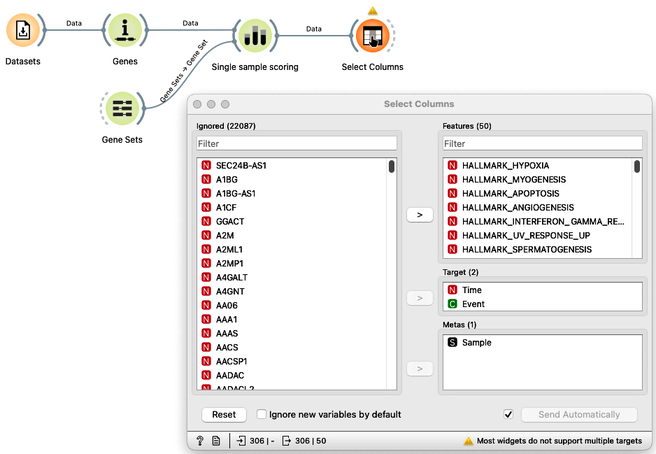

Now we can use the Rank Survival Features widget to rank the gene sets according to survival. Let’s order the genes according to the p-value. The three best-ranked gene sets are those related to angiogenesis, signaling via tgf-beta cytokine, and the transition of cells from epithelial to mesenchymal phenotype. 

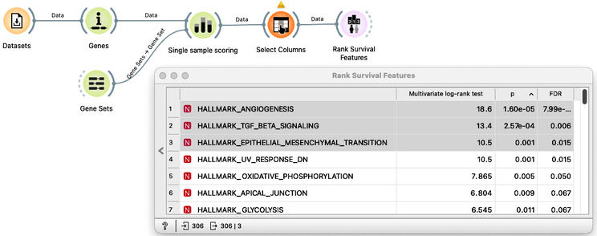

If we want to produce the corresponding Kaplan-Maier plots, we select the top three and pass them on to Discretize. In Discretize we again mark the three gene sets and choose to split them into intervals of equal frequency. 

<!-- 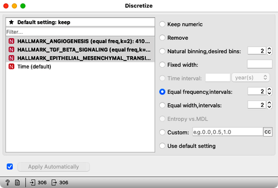 -->

Finally we pass the data to the Kaplan-Maier widget, tick the boxes for showing the median and confidence intervals, and group by one of the three gene sets. 

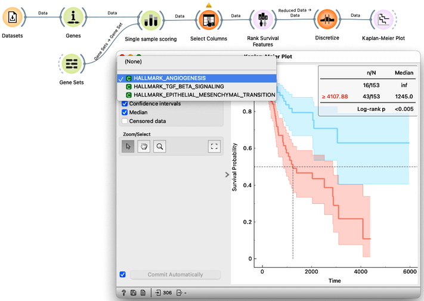

For all of the top three ranking gene sets, over-expression of the gene set is associated with a worse prognosis. Angiogenesis is the process of blood vessel formation. Cancer cells, like all cells, need nutrients and oxygen in order to grow and function properly. So when a tumor mass grows, blood vessels are formed to ensure a fresh blood supply. The literature also indicates that tgf-beta exerts tumor-promoting effects in late stage cancer, increasing tumor invasiveness and metastasis. Similarly, epithelial-mesenchymal transition, which refers to the dedifferentiation of epithelial cells, has been shown to be involved in the initiation of metastasis in cancer progression. The correlations we found between gene set overexpression and biological activity are intriguing. They make sense to us because of prior knowledge, but we should always keep in mind that they do not prove causation. 

In this survival analysis course we presented the core concepts and frequently used methods of survival analysis. Using Orange, we went from simple data analysis pipelines for censored data to ever more complex ones. Orange includes a number of interactive data analytics components to support exploration of survival data. 