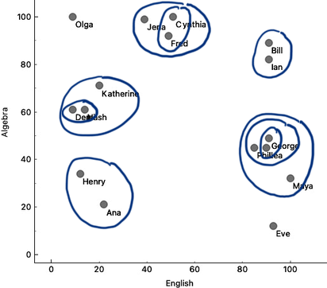
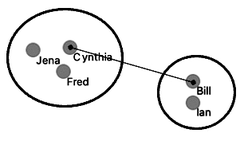
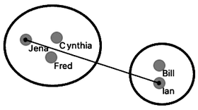
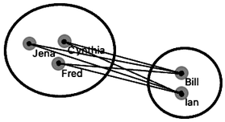
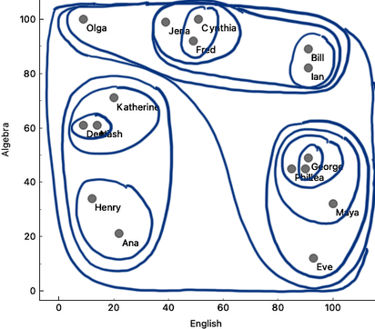

For clustering, we have [just discovered](https://books.biolab.si/books/intro-data-analytics#3-euclidean-distance-in-2d) that we first need to define the distance between data instances. Now that we did, let us introduce a simple clustering algorithm and think about what else we need for it.

<!!! float-aside !!!>

When introducing distances, we worked with the grades data set and reduced it to two dimensions. We got it from the Datasets widget and then use Select Columns to construct a data set that contains only the grades for English and Algebra.

The Hierarchical Clustering algorithm assumes that every data instance, meaning each of our students, is at the beginning of its own cluster. Then, in each step, the algorithm merges the two closest clusters. Demi and Nash are closest in our data, so let’s join them into the same cluster. Lea and George are also close, so we merge them. Phil is close to the Lea-George cluster, and we now have the Phil-Lea-George cluster. We continue with Bill and Ian, then Cynthia and Fred, and add Jena to the Cynthia-Fred cluster, Katherine to Demi-Nash, and Maya to Phil-Lea-George, Henry joins Ana, and Eve joins Phil-Lea-George-Maya. And now, just with a quick glance – and we could be wrong – we will merge the Bill-Ian cluster to Jena-Fred-Cynthia.

<!!! float-aside !!!>
For the two-dimensional data, we could do hierarchical clustering by hand, in each iteration circling the two clusters we join into a group.

<!!! float-aside !!!>

Single linkage.

Though, hold on! How do we know which clusters are close to each other? 
Did we actually measure the distances between clusters? Whatever we have done so far was just informed guessing. We should be more precise.

Say, how do we know that Bill-Ian should go with Jena-Cynthia-Fred, and to George-Phil-Lea and the rest? We need to define the computation of distances between clusters. Remember, in each iteration, we said that hierarchical clustering should join the closest two clusters. How do we measure the distance between Jena-Cynthia-Fred and Bill-Ian clusters? Note that what we have are the distances between data items, that is, between individual students. 

<!!! float-aside !!!>

Complete linkage.

How do we actually make sure what are the distances betwen clusters?
There are several ways to measure the distances between clusters. In the simplest, we can define cluster distance as the distance between two of their closest data items. We call this distance a “single linkage”. Cynthia and Bill are the closest. If we use a single linkage, this distance defines the distance between two clusters. 

We could also take two data instances that are the farthest away from each other and use their distance to define the cluster distance. This is called “complete linkage”; if we use it, Jena and Ian represent the cluster distance. 

In a third variant, we would consider all the pairwise distances, say, between Ian and Cynthia, Ian and Fred, Bill and Cythia, Bill and Jena, Bill and Fred, and from them compute the average distance. This is, not surprisingly, called the “average linkage”.

<!!! float-aside !!!>

Average linkage.

Now we have just defined the second ingredient we need for hierarchical clustering, besides ways to measure the distance between data items, is the way to compute the distance between clusters. Before, when we started to join clusters manually, we used just a sense of closeness, probably something similar to average linkage. Let us continue in this way for just a while. 

We will join the Henry-Ana cluster to Demi-Nash-Katherine, and perhaps merge Olga with a cluster on the right. We will then add the top cluster to the one on the bottom right – although here, we do not know exactly which solution is the best. We would need something like Orange to compute cluster distances for me. Finally, we can merge the remaining two clusters.

Here our merging stops. There’s nothing else we can merge. The hierarchical clustering algorithm stops when everything is merged into one cluster. Below is the result of hierarchical clustering on my two-dimensional data set of student grades.

Our depiction of clustering looks, at best, a bit messy, but somehow still shows a clustering structure. There should be a better, more neat way to present the clustering results. And we still need to answer how many clusters there are. 